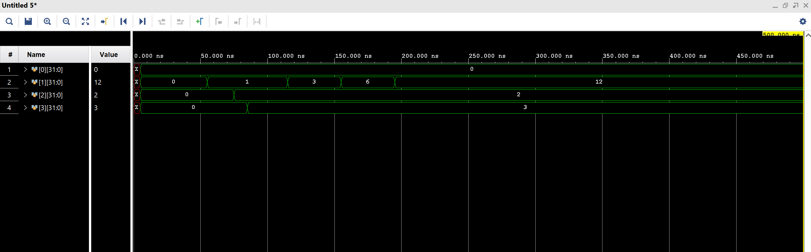

# Full MIPS 5-Stage Pipeline — Janne's Implementation

## Overview

A complete 5-stage MIPS pipeline processor implemented in Verilog, integrating modules from four separate sub-projects (Fetch, Decode, Execute, Memory/Writeback) into a unified top-level wrapper.

### Pipeline Stages

| Stage | Module | Key Sub-Modules |
|-------|--------|-----------------|
| **IF** (Fetch) | `fetch.v` | `mux`, `pc`, `incrementer`, `instrMem`, `ifIdLatch` (in `components.v`) |
| **ID** (Decode) | `decode.v` | `regfile.v`, `control.v`, `signExt.v`, `idExLatch.v` |
| **EX** (Execute) | `execute.v` | `adder.v`, `bottom_mux.v`, `alu.v`, `alu_control.v`, `ex_mem.v` |
| **MEM** (Memory) | `mem_stage.v` | `data_memory.v`, `AND.v`, `mem_wb.v` |
| **WB** (Writeback) | Combinational mux in `mips_pipeline.v` | — |

## Test Program

The pipeline runs the following instruction sequence (loaded from `instr.mem`):

```
LW  $1, 1($0)       # $1 = DMEM[1] = 1
LW  $2, 2($0)       # $2 = DMEM[2] = 2
LW  $3, 3($0)       # $3 = DMEM[3] = 3
NOP × 2
ADD $1, $1, $2       # $1 = 1 + 2 = 3
NOP × 3
ADD $1, $1, $3       # $1 = 3 + 3 = 6
NOP × 3
ADD $1, $1, $1       # $1 = 6 + 6 = 12
NOP × 4
ADD $1, $1, $0       # $1 = 12 + 0 = 12
NOP × 5
```

**Expected Final Register State:**
- `$0 = 0` (hardwired zero)
- `$1 = 12` ← result of `(1 + 2) + 3 + 6 + 0`
- `$2 = 2`
- `$3 = 3`

## Data Memory (`data.mem`)

```
Word 0: 0
Word 1: 1
Word 2: 2
Word 3: 3
Word 4: 4
Word 5: 5
```

## Testbench (`mips_pipeline_tb.v`)

The testbench:
- Generates a 10ns clock (100 MHz)
- Asserts reset for 10ns
- Runs for 500ns total (enough for all 24 instructions to complete through the pipeline)
- Prints cycle-by-cycle register values and writeback signals to the console

## How to Simulate in Vivado

1. Create a new Vivado project
2. **Add Design Sources**: Add all `.v` files (except `mips_pipeline_tb.v`)
3. **Add Simulation Sources**: Add `mips_pipeline_tb.v`
4. **Copy `.mem` files**: Place `instr.mem` and `data.mem` in the simulation working directory (typically `<project>.sim/sim_1/behav/xsim/`)
5. **Set Top Modules**: Design top = `mips_pipeline`, Simulation top = `mips_pipeline_tb`
6. **Run Behavioral Simulation**

### Viewing Register Outputs in the Waveform

The pipeline has no external output ports, so you must drill into the register file to observe values. After the simulation launches, run these Tcl commands in the Vivado Tcl Console:

```tcl
add_wave /mips_pipeline_tb/uut/stage2_decode/rf0/registers[0]
add_wave /mips_pipeline_tb/uut/stage2_decode/rf0/registers[1]
add_wave /mips_pipeline_tb/uut/stage2_decode/rf0/registers[2]
add_wave /mips_pipeline_tb/uut/stage2_decode/rf0/registers[3]
restart
run 500ns
```

Then right-click each signal in the waveform → **Radix → Unsigned Decimal** for readable values.

You should see `registers[1]` progress: **0 → 1 → 3 → 6 → 12**

## Timing Diagram Result



The waveform confirms:
- `registers[0]` = 0 (constant)
- `registers[1]` = 0 → 1 → 3 → 6 → **12** ✓
- `registers[2]` = 0 → 2
- `registers[3]` = 0 → 3

## Control Signal Encoding

```
ex[3:0]  = {RegDst, ALUOp1, ALUOp0, ALUSrc}
mem[2:0] = {Branch, MemRead, MemWrite}
wb[1:0]  = {RegWrite, MemToReg}
```

## File List

| File | Description |
|------|-------------|
| `mips_pipeline.v` | Top-level wrapper connecting all 5 stages |
| `fetch.v` | IF stage wrapper |
| `components.v` | Fetch sub-modules (mux, PC, incrementer, instrMem, ifIdLatch) |
| `decode.v` | ID stage wrapper |
| `regfile.v` | 32-register file with synchronous write |
| `control.v` | Main control unit (opcode → control signals) |
| `signExt.v` | 16-to-32 sign extension |
| `idExLatch.v` | ID/EX pipeline register |
| `execute.v` | EX stage wrapper |
| `alu.v` | Arithmetic Logic Unit |
| `alu_control.v` | ALU control decoder (ALUOp + funct → ALU select) |
| `adder.v` | Branch target adder |
| `bottom_mux.v` | 5-bit RegDst mux |
| `ex_mem.v` | EX/MEM pipeline register |
| `mem_stage.v` | MEM stage wrapper |
| `data_memory.v` | Data RAM |
| `AND.v` | Branch decision AND gate |
| `mem_wb.v` | MEM/WB pipeline register |
| `mips_pipeline_tb.v` | Testbench |
| `instr.mem` | Instruction memory contents (binary) |
| `data.mem` | Data memory contents (binary) |
| `JanneTimingDiagram.png` | Simulation timing diagram proof |


# Full MIPS 5-Stage Pipeline — Jesus' Implementation

The example program used in this pipeline demonstrates sequential accumulation (e.g., summing   values like 1 + 2 + 3 + 6 = 12).  


  
#R-Type (Register instructions like ADD)  

-Used for operations like: ADD, SUB, AND, OR, SLT  

[31:26] opcode   (6 bits)  
[25:21] rs       (5 bits)  
[20:16] rt       (5 bits)  
[15:11] rd       (5 bits)  
[10:6]  shamt    (5 bits)  
[5:0]   funct    (6 bits)  

Example: ADD R1, R2, R3

opcode = 000000 (R-type)
funct = 100000 (ADD)


#I-Type (Immediate instructions like LW, SW, BEQ)  
  
-LW, SW, BEQ, ADDI  
  
[31:26] opcode   (6 bits)  
[25:21] rs       (5 bits)  
[20:16] rt       (5 bits)  
[15:0]  immediate (16 bits)  
  


To view the proper registers from instantiated module I went to "Scope" then under "Objects" the corresponding registers to each module were dragged and dropped into the waveform.  


instr.mem  


data.mem  


